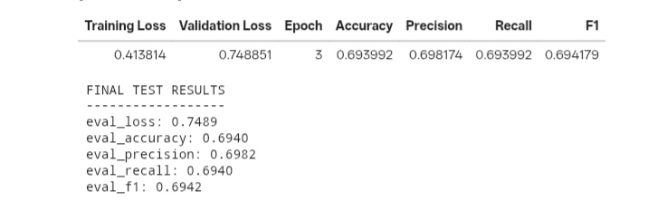
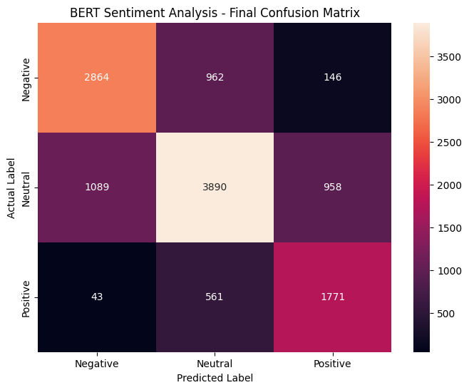
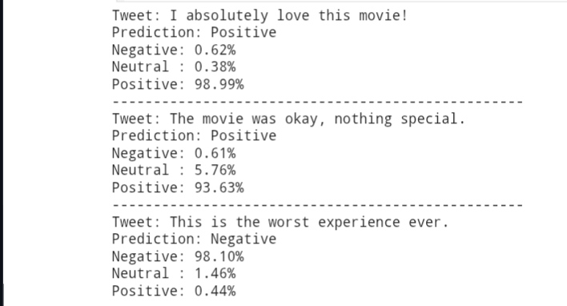

  # BERT Sentiment Analysis
  
  A transformer-based sentiment analysis system that classifies tweets into **Negative, Neutral, and Positive** sentiments using **BERT (Bidirectional Encoder Representations from Transformers)** and the **TweetEval Sentiment** dataset.
  
  ## 📌 Project Overview
  
  This project fine-tunes the pretrained `bert-base-uncased` model for three-class sentiment classification.
  
  The system takes a tweet as input and predicts its sentiment:
  
  - 🔴 Negative
  - 🟡 Neutral
  - 🟢 Positive
  
  The project demonstrates an end-to-end NLP workflow, including text preprocessing, BERT tokenization, model fine-tuning, hyperparameter selection, evaluation, confusion-matrix analysis, and real-world sentiment prediction.
  
  ---
  
  ## 🎯 Objectives
  
  - Build a transformer-based sentiment classification model.
  - Fine-tune pretrained BERT for tweet sentiment analysis.
  - Compare different learning rates to select an effective configuration.
  - Evaluate the model using standard classification metrics.
  - Analyze model performance using a confusion matrix.
  - Demonstrate sentiment prediction on new, unseen text.
  
  ---
  
  ## 🗂️ Dataset
  
  The project uses the **TweetEval Sentiment** dataset from CardiffNLP.
  
  The dataset contains three sentiment classes:
  
  | Label | Sentiment |
  |---:|---|
  | 0 | Negative |
  | 1 | Neutral |
  | 2 | Positive |
  
  ### Dataset Splits
  
  | Split | Samples |
  |---|---:|
  | Training | 45,615 |
  | Validation | 2,000 |
  | Test | 12,284 |
  
  ---
  
  ## 🧠 Model
  
  ### BERT — `bert-base-uncased`
  
  The project uses the pretrained BERT Base Uncased model and fine-tunes it for a three-class sequence-classification task.
  
  ### Architecture
  
  Input Tweet → Text Preprocessing → BERT Tokenizer → BERT Encoder → Classification Layer → Negative / Neutral / Positive
  
  The classification layer contains three output classes corresponding to the three sentiment categories.
  
  ---
  
  ## 🔄 Methodology
  
  ### 1. Text Preprocessing
  
  Tweets were lightly preprocessed by:
  
  - Removing URLs
  - Normalizing user mentions to `@user`
  - Removing unnecessary whitespace
  
  Hashtags and punctuation were retained because they may provide useful contextual information for sentiment classification.
  
  ### 2. Tokenization
  
  Tweets were tokenized using the BERT tokenizer with:
  
  - Maximum sequence length: **128**
  - Padding: `max_length`
  - Truncation: enabled
  
  ### 3. Model Fine-Tuning
  
  The pretrained `bert-base-uncased` model was fine-tuned using Hugging Face Transformers.
  
  ### 4. Evaluation
  
  The model was evaluated using:
  
  - Accuracy
  - Precision
  - Recall
  - F1-score
  - Confusion Matrix
  
  Weighted averaging was used for Precision, Recall, and F1-score.
  
  ---
  
  ## ⚙️ Hyperparameter Tuning
  
  Different learning rates were evaluated while keeping the other training settings consistent.
  
  | Learning Rate | Best Validation F1 |
  |---:|---:|
  | `3e-5` | 73.43% |
  | `2e-5` | 74.11% |
  | **`1e-5`** | **75.01%** |
  
  ### Selected Configuration
  
  | Parameter | Value |
  |---|---|
  | Learning Rate | `1e-5` |
  | Training Batch Size | `16` |
  | Evaluation Batch Size | `16` |
  | Epochs | `3` |
  | Maximum Sequence Length | `128` |
  | Weight Decay | `0.01` |
  | Model | `bert-base-uncased` |
  
  The learning rate of **`1e-5`** achieved the highest validation F1-score and was selected for the final model.
  
  ---
  
  ## 📊 Final Test Results
  
  The final selected model was evaluated on the unseen test set.
  
  | Metric | Score |
  |---|---:|
  | **Accuracy** | **69.40%** |
  | **Precision** | **69.82%** |
  | **Recall** | **69.40%** |
  | **F1-score** | **69.42%** |
  | Test Loss | **0.7489** |
  
  ### Final Test Results

  ### Result Summary
  
  The final BERT model achieved approximately **69.4% accuracy** and **69.42% weighted F1-score** on the unseen test set.
  
  ---
  
  ## 📈 Confusion Matrix
  
  The final model produced the following confusion matrix on the test set:
  
  | Actual / Predicted | Negative | Neutral | Positive |
  |---|---:|---:|---:|
  | **Negative** | 2864 | 962 | 146 |
  | **Neutral** | 1089 | 3890 | 958 |
  | **Positive** | 43 | 561 | 1771 |

  ### Confusion Matrix

  
  ### Interpretation
  
  - **Negative:** 2,864 tweets were correctly classified as Negative.
  - **Neutral:** 3,890 tweets were correctly classified as Neutral.
  - **Positive:** 1,771 tweets were correctly classified as Positive.
  - The model shows some confusion between **Negative and Neutral** sentiments.
  - There is also noticeable confusion between **Neutral and Positive** sentiments.
  - Neutral and ambiguous tweets are comparatively more challenging for the model.
  
  ---
  
  ## 🧪 Sample Predictions
  
  The trained BERT model was tested on new text samples to demonstrate its sentiment classification capability.
  
  | Input | Predicted Sentiment |
  |---|---|
  | `I absolutely love this movie!` | Positive |
  | `The movie was okay, nothing special.` | Positive |
  | `This is the worst experience ever.` | Negative |

  ### Sample Predictions

  
  ### Prediction Example
  
  For the input:
  
  `I absolutely love this movie!`
  
  The model predicted:
  
  **Positive**
  
  The model also provides sentiment probabilities, allowing the predicted class and its confidence to be analyzed.
  
  ---
  
  ## 🛠️ Tech Stack
  
  ### Programming Language
  - Python
  
  ### Machine Learning & NLP
  - PyTorch
  - Hugging Face Transformers
  - Hugging Face Datasets
  - BERT (`bert-base-uncased`)
  
  ### Data Processing
  - Pandas
  - NumPy
  - Regular Expressions
  
  ### Evaluation
  - Scikit-learn
  
  ### Visualization
  - Matplotlib
  - Seaborn
  
  ### Development Environment
  - Google Colab
  - Google Drive
  
  ### Version Control
  - GitHub
  
  ---
  
  ## 📁 Project Structure
  
  bert-sentiment-analysis/
  ├── BERT_Sentiment_Analysis.ipynb
  ├── requirements.txt
  ├── final_results.csv
  └── best_model/
      ├── config.json
      ├── model.safetensors
      ├── tokenizer.json
      ├── tokenizer_config.json
      ├── special_tokens_map.json
      └── vocab.txt
  
  > The trained model files are saved separately when repository size limitations apply.
  
  ---
  
  ## 🚀 Installation
  
  Clone the repository:
  
  git clone https://github.com/kondamsudeepthi-prog/bert-sentiment-analysis.git
  cd bert-sentiment-analysis
  
  Install the required dependencies:
  
  pip install -r requirements.txt
  
  ---
  
  ## ▶️ Usage
  
  Open the notebook:l.
  
  `BERT_Sentiment_Analysis.ipynb`
  
  The notebook contains the complete workflow:
  
  Dataset Loading → Text Preprocessing → BERT Tokenization → Model Fine-Tuning → Hyperparameter Tuning → Test Evaluation → Confusion Matrix → Sample Predictions
  
  ---
  
  ## 💡 Example Prediction
  
  text = "I absolutely love this movie!"
  
  # The trained BERT model predicts:
  # Positive
  
  ---
  
  ## 🔍 Key Learnings
  
  Through this project, the following concepts were implemented:
  
  - Natural Language Processing
  - Text preprocessing
  - BERT tokenization
  - Transfer learning
  - Transformer-based sequence classification
  - Model fine-tuning
  - Hyperparameter tuning
  - Classification metrics
  - Confusion matrix analysis
  - GPU-based model training
  - Model saving
  - GitHub project organization
  
  ---
  
  ## 🚧 Limitations
  
  The current model achieves approximately **69.4% test accuracy**, leaving room for further improvement.
  
  Potential challenges include:
  
  - Ambiguous tweets
  - Sarcasm and irony
  - Short-context text
  - Informal language
  - Mixed sentiment
  - Difficulty distinguishing Neutral from Positive or Negative sentiments
  
  ---
  
  ## 🔮 Future Improvements
  
  Possible improvements include:
  
  - Learning-rate scheduling
  - Early stopping
  - Class-weighted loss
  - Data augmentation
  - More extensive hyperparameter optimization
  - Domain-specific pretrained language models
  - Better handling of sarcasm and ambiguous language
  - Building a Streamlit web interface
  - Deploying the model as an API using FastAPI
  
  ---
  
  ## 👩‍💻 Author
  
  **Sudeepthi Kondam**
  
  B.Tech CSE (AI & ML)
  
  ## 📜 License
  
  This project is intended for educational and portfolio purposes.
